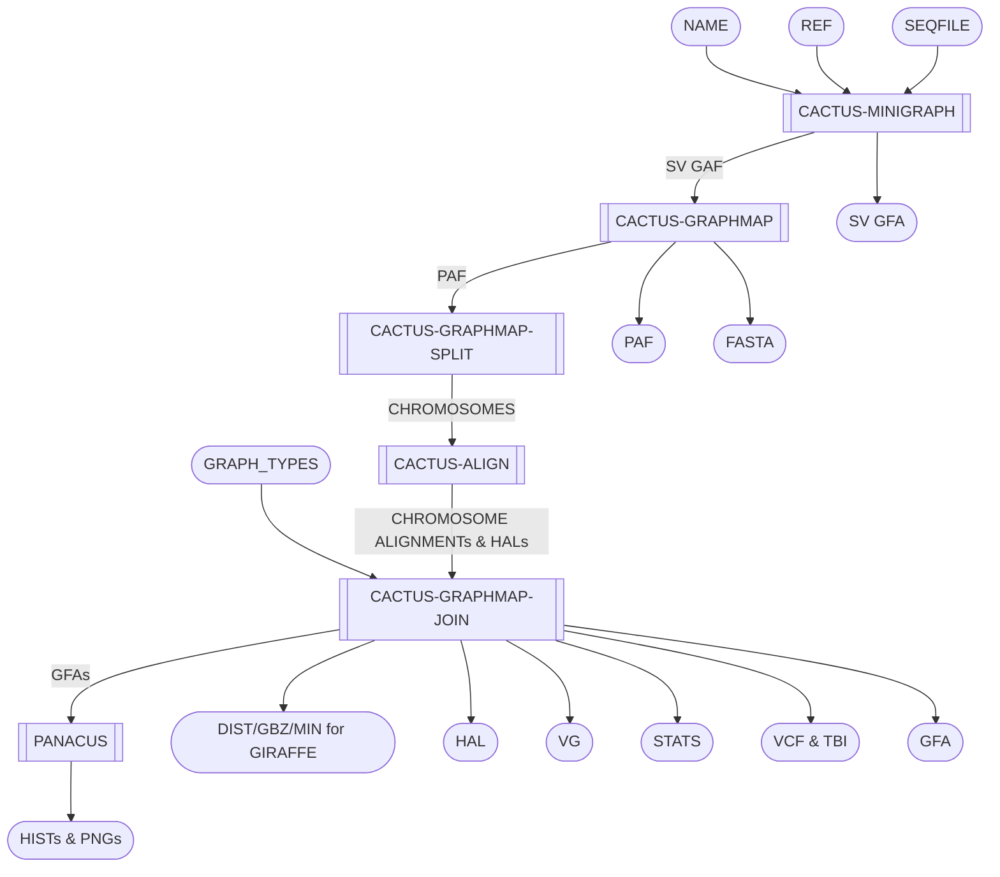

# Minigraph-Cactus Graph Builder - MCGB

Build pangenome graphs with minigraph-cactus.

## Pipeline Chart

## Pipeline Files
* mcgb.wdl          - WDL pipeline
* mcgb.inputs.json  - pipeline inputs with place holders
* mcgb.outputs.yaml - steps and outputs to be copied after pipeline run
* mcgb.imports.zip  - imports used in the WDL
* mcgb.doc.md       - this file, documenting the pipeline

## Inputs
* name [String] - output base name
* ref [String] - the sequence name in the seqfile to as the "reference"
* seqfile [File] - tab sepqarated file of sequence names and URLs (files)
* graph_types [Array[String]] - output full and/or clip versions of the graph as GFA and GBZ
* docker [String] - docker to use (cactus)
* cpu [Int] - cpus to request
* memory [Int] - memory to request

## Steps
### run_cactus_minigraph
#### input
* name [workflow inputs]
* ref [workflow inputs]
* seqfile [workflow inputs]
#### output
* sv_gfa
### run_cactus_graphmap
#### input
* name [workflow inputs]
* ref [workflow inputs]
* seqfile [workflow inputs]
* sv_gfa [run_cactus_minigraph]
#### output
* fasta
* gaf
* paf
* seqfile [updated with minigraph fasta, not retained]
### run_cactus_graphmap_split
#### input
* ref [workflow inputs]
* seqfile [run_cactus_graphmap]
* paf [run_cactus_graphmap]
* sv_gfa [run_cactus_minigraph]
#### output
* chroms (not retained)
### run_cactus_align
#### input
* ref [workflow inputs]
* chroms [run_cactus_graphmap_split]
#### output
* alignments (not retained)
### run_cactus_graphmap_join
#### input
* name [workflow inputs]
* ref [workflow inputs]
* alignments [run_cactus_align]
#### output
Most outputs will have a full and clip version, if running full and clip were sepdicfied. The full ones have "full" in the file name.
* dist(s)
* gbz(s)
* gfa(s)
* hal(s)
* min(s)
* stats
* vcf(s)
* vcf_tbi(s)
### panacus
#### input
* gfa(s)[run_cactus_graphmap_join]
#### output
* hist(s)
* png(s)
